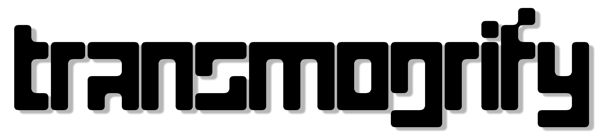

# 
Transmogrify is a tool that converts markdown sprinkled with some Lisp to LaTeX

## Documentation
Refer to the [user manual](user_manual/user_manual.pdf). The user manual has been
written using transmogrify, so [`user_manual.md`](user_manual/user_manual.md) can be used as an example

## Usage
```$ transmogrify <in.md> <out.tex>```

Pair it with [`scribe`](https://github.com/abhirag/scribe) to get a complete system for documenting your programs

## Features
- Single binary
- Support for basic markdown syntax
- Configuration using an embedded Lisp
- Markdown extensions written in Lisp:
    - Abstract
    - Table of Contents
    - Sidenote
    - Marginnote
- In-built support for rendering svg diagrams written in [pikchr language](https://pikchr.org/home/doc/trunk/homepage.md)

## Dependencies
All dependencies are vendored under `subprojects/`. No external dependencies 

## Build
Transmogrify is written in `C11`, so you will need a `C` compiler that supports that standard.
We are using [meson](https://mesonbuild.com/) with the [ninja](https://ninja-build.org/) backend:

| `meson`       | `ninja`       |
| ------------- | ------------- |
| 0.59.2        | 1.10.2        |

1. Get the `ninja` binary from [here](https://github.com/ninja-build/ninja/releases)
2. Add the location of your `ninja` binary to your PATH environment variable
3. [Install meson](https://mesonbuild.com/Quick-guide.html)
4. Navigate to the project directory
5. `$ meson builddir`
6. `$ cd builddir`
7. `$ meson compile`

## Status
This is the first alpha release. All the above mentioned features work
but we need more testing and polish to enter the beta phase. For now, stability
not guaranteed

## Roadmap
1. Theming
2. Conversion to `html`
3. Conversion to plaintext
4. More syntax extensions

